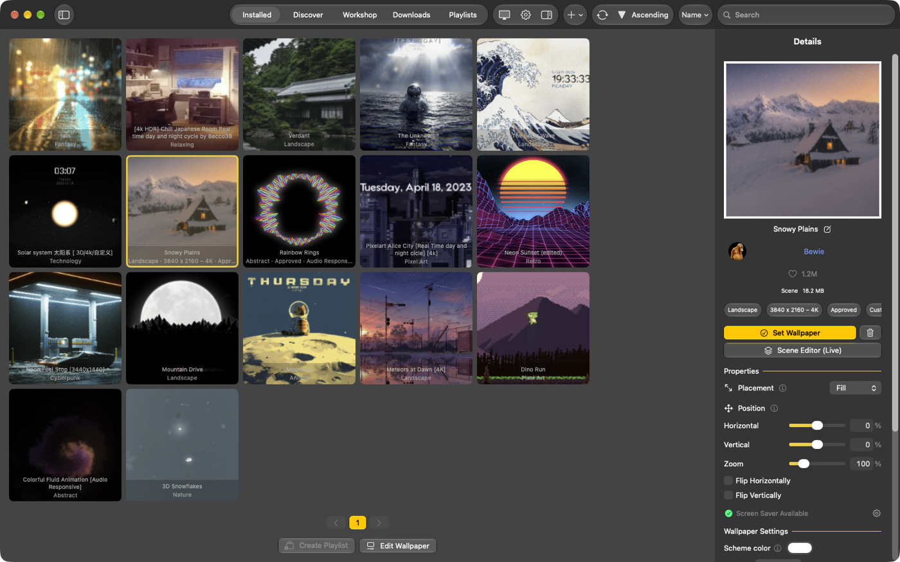
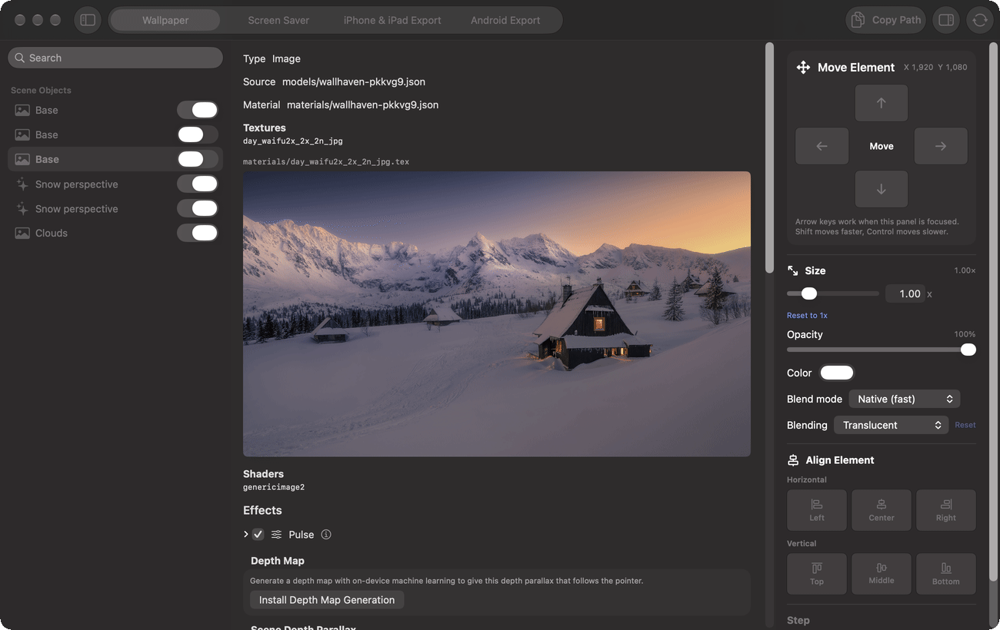
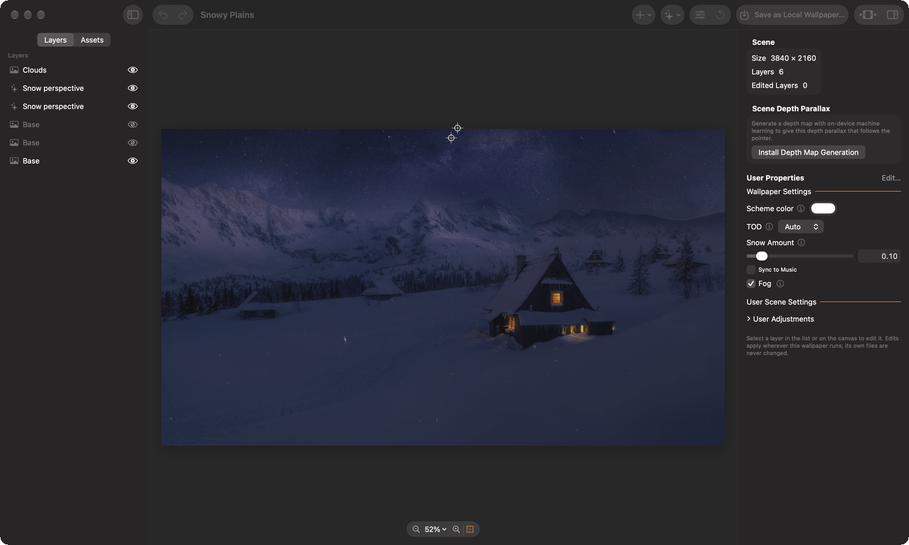
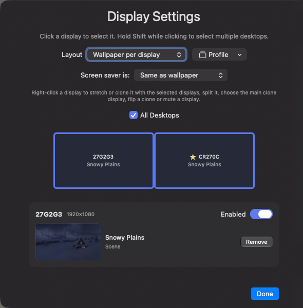
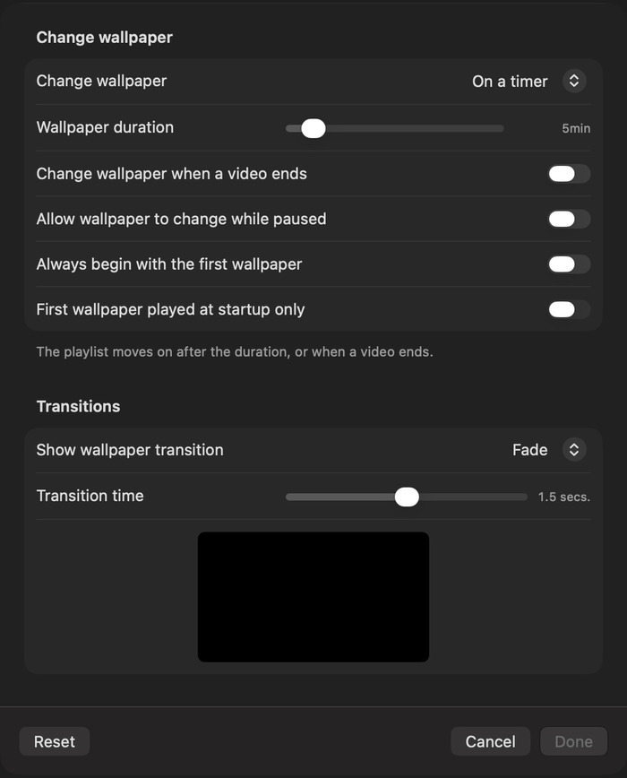
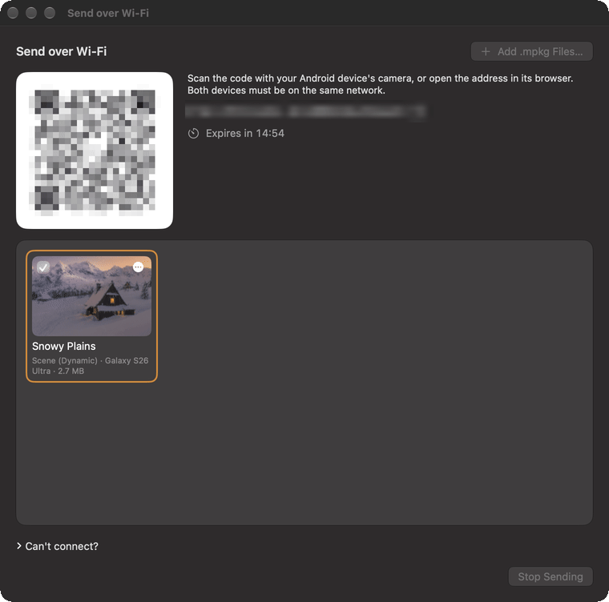
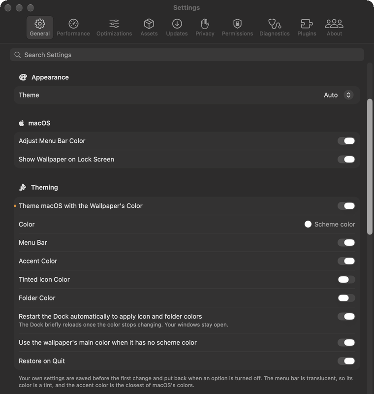
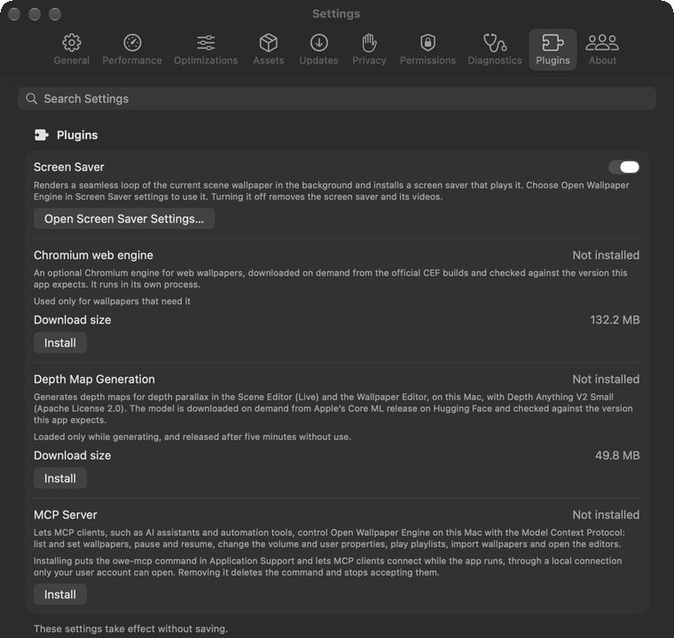

Open Wallpaper Engine
=========

[English](../../README.md) | [Deutsch](README.de.md) | [Français](README.fr.md) | [Español](README.es.md) | [Português (Brasil)](README.pt-BR.md) | [Italiano](README.it.md) | [日本語](README.ja.md) | [한국어](README.ko.md) | [简体中文](README.zh-Hans.md) | [繁體中文](README.zh-Hant.md) | [Русский](README.ru.md) | [Polski](README.pl.md) | [Türkçe](README.tr.md) | [Українська](README.uk.md) | **العربية** | [हिन्दी](README.hi.md)

Open Wallpaper Engine مشغّل مجاني ومفتوح المصدر لنظام macOS يعرض خلفيات Wallpaper Engine: المشهد والفيديو والويب. يضم محرك عرض أصليًا مبنيًا على Metal، ويدعم التأثيرات والجسيمات والنماذج ثلاثية الأبعاد والإضاءة وSceneScript والمؤثرات المرئية المتفاعلة مع الصوت وورشة Steam. بدأ المشروع كنسخة متفرعة (fork) من [Open Wallpaper Engine](https://github.com/MrWindDog/wallpaper-engine-mac) لمطوّريه Haren Chen وMrWindDog، ثم أُعيدت كتابة معظمه منذ ذلك الحين.

> **ملاحظة:** هذا المشروع غير تابع لتطبيق Wallpaper Engine التجاري على Steam. إنه تطبيق مفتوح المصدر لنظام macOS يمكنه عرض ملفات خلفيات الشاشة من ورشة Steam الخاصة بـ Wallpaper Engine. → [ATTRIBUTION.txt](../../ATTRIBUTION.txt)

**الموقع:** [openwallpaperengine.app](https://openwallpaperengine.app/) · **الويكي:** [الأدلة وحل المشكلات](https://github.com/deepratna-awale/open-wallpaper-engine-mac/wiki)

## أبرز الميزات

- **خلفيات المشهد والفيديو والويب** — تُرسم المشاهد باستخدام مظللات Wallpaper Engine الخاصة بكل خلفية بعد ترجمتها إلى Metal، مع التأثيرات والجسيمات والنماذج ثلاثية الأبعاد والأضواء والخطوط الزمنية وSceneScript والمؤثرات المرئية المتفاعلة مع الصوت. تعمل خلفيات الويب في WebKit أو في محرك Chromium الاختياري.
- **ورشة Steam** — تصفّح الورشة وصفِّ محتواها ونزّل منها داخل التطبيق، أو استورد مجلدات الخلفيات وملفات zip.
- **تحرير/تصدير المشهد** — غيّر طبقات الخلفية قيد التشغيل وتأثيراتها مباشرةً على سطح المكتب، أو سجّل منها شاشة توقف خاصة بك، أو صدّرها كشاشة قفل بصورة حيّة (Live Photo) لأجهزة iPhone وiPad أو كحزمة لتطبيق Wallpaper Engine على Android.

  

- **محرر الخلفيات** — محرر على نهج محرر Wallpaper Engine: الطبقات، والتأثيرات مع معاينات، والخط الزمني، وSceneScript، وخصائص المستخدم، والجسيمات، وPuppet Warp. تُحفظ تعديلاتك بجانب الخلفية، ولا تُكتب أبدًا في ملفاتها.

  

- **شاشات العرض** — خلفية لكل شاشة، أو خلفية واحدة ممتدة عبر الشاشات أو مكرّرة على كل منها، مع المجموعات والتقسيمات والملفات الشخصية، كما في Wallpaper Engine.

  

- **قوائم التشغيل** — بدّل الخلفيات وفق مؤقّت، أو عند تسجيل الدخول، أو حسب وقت اليوم أو يوم الأسبوع، مع انتقالات Wallpaper Engine.

  

- **التصدير** — شاشات قفل بصور حيّة لأجهزة iPhone وiPad، وحزم Wallpaper Engine لنظام Android، تُرسل إلى الهاتف عبر Wi-Fi باستخدام رمز QR.

  

- **السمات** — يتبع شريط القوائم ولون التمييز والمجلدات الملوّنة ألوانَ الخلفية.

  

- **إضافة خادم MCP** — يمكن لعملاء MCP تعيين الخلفيات وقوائم التشغيل والإعدادات وتحرير المشاهد عبر اتصال محلي لا يستطيع فتحه سوى حسابك.

  

كل ما عدا ذلك، مرتّبًا حسب المجال: [docs/features.md](../../docs/features.md).

## التثبيت

1. نزّل أحدث إصدار من [openwallpaperengine.app](https://openwallpaperengine.app/) أو من [GitHub Releases](https://github.com/deepratna-awale/open-wallpaper-engine-mac/releases). التطبيق موقَّع وموثَّق من Apple، ويحدّث نفسه تلقائيًا.
2. افتح ملف DMG واسحب **Open Wallpaper Engine** إلى مجلد التطبيقات.

يتطلب **macOS 14.0 (Sonoma) أو أحدث**. تحتاج بعض الميزات إلى إصدار أحدث من macOS أو إلى إذن أو إضافة: راجع [البدء](../../docs/getting-started.md#requirements).

## البدء السريع

1. افتح التطبيق. يضبط مساعد الإعداد اللغة وSteamCMD وتسجيل دخولك إلى Steam وملفات Wallpaper Engine؛ ويمكن تخطي كل خطوة.
2. ثبّت ملفات Wallpaper Engine (*الإعدادات › الموارد*) إذا كنت تريد خلفيات المشهد. تأتي هذه الملفات من نسختك الخاصة من Wallpaper Engine على Steam؛ أما خلفيات الفيديو والويب فتعمل بدونها.
3. ابحث عن الخلفيات في علامة التبويب **الورشة**، أو استورد مجلد خلفية أو ملف zip (*ملف › استيراد خلفية من مجلد…*، ⌘I).
4. انقر على خلفية في المكتبة، ثم على **تعيين خلفية الشاشة** في تفاصيلها. تظهر خصائصها أسفلها.

المزيد: [البدء](../../docs/getting-started.md) و[الويكي](https://github.com/deepratna-awale/open-wallpaper-engine-mac/wiki).

## الخصوصية

كل ما يحفظه التطبيق يبقى على جهاز Mac الخاص بك، ولا يجمع أي بيانات أو تحليلات. يتصل التطبيق بـ Steam (للورشة والملفات) وبـ GitHub (للتحديثات)، ولا تُنزَّل الإضافات إلا عند تثبيتها. التفاصيل: [ما يتصل به التطبيق](../../docs/getting-started.md#what-the-app-connects-to) و[سياسة الخصوصية](../../docs/legal/privacy-policy.md).

## التوثيق

- [البدء](../../docs/getting-started.md) — المتطلبات والملفات والورشة والاستيراد
- [الميزات](../../docs/features.md) — كل ما يدعمه التطبيق وكيفية استخدامه
- الأدلة: [تخطيطات الشاشات](../../docs/display-layouts.md) · [قوائم التشغيل](../../docs/playlists.md) · [شاشة التوقف](../../docs/screen-saver.md) · [التصدير إلى iPhone وiPad](../../docs/iphone-ipad-export.md) · [التصدير إلى Android](../../docs/android-export.md) · [خرائط العمق](../../docs/depth-maps.md) · [السمات](../../docs/theming.md) · [خادم MCP](../../docs/mcp.md) · [محرك الويب Chromium](../../docs/chromium-engine.md)
- [التطوير](../../docs/development.md) — البناء من المصدر وبنية المشروع؛ وانظر أيضًا [CONTRIBUTING.md](../../CONTRIBUTING.md) و[البنية المعمارية](../../docs/architecture.md)
- [الويكي](https://github.com/deepratna-awale/open-wallpaper-engine-mac/wiki) — الأدلة ومرجع الإعدادات وحل المشكلات

## مشاريع ذات صلة

- **[Open Wallpaper Engine for Linux](https://github.com/Unayung/simple-linux-wallpaperengine-gui)** — واجهة رسومية مبنية على PyQt6 لـ [linux-wallpaperengine](https://github.com/Almamu/linux-wallpaperengine)، مع تكامل مع ورشة Steam وتصميم واجهة مستوحى من إصدار macOS هذا.

## شكر وتقدير

بُني هذا المشروع على عمل كلٍّ من:

- **[MrWindDog](https://github.com/MrWindDog)** — مشرف النسخة الأصلية [wallpaper-engine-mac](https://github.com/MrWindDog/wallpaper-engine-mac)، وقد أضاف ميزات جديدة وتحسينات على الواجهة
- **[Haren Chen](https://github.com/haren724)** — المُنشئ الأصلي لـ [open-wallpaper-engine-mac](https://github.com/haren724/open-wallpaper-engine-mac)، وقد بنى البنية الأساسية للتطبيق (SwiftUI، وتشغيل خلفيات الفيديو، ونظام الاستيراد، وواجهة قائمة التشغيل)
- **1ris_W** — الترجمة الصينية
- **[Klaus Zhu](https://github.com/klauszhu1105)** — تصميم الشعار الأصلي
- **[Chen Chia Yang](https://github.com/Unayung)** — عرض خلفيات المشهد، وإصلاحات خلفيات الويب، والتكامل مع ورشة Steam، ودعم شاشات العرض المتعددة، والاستيراد من ملفات zip
- **[Deepratna Awale](https://github.com/deepratna-awale)** — عارض المشاهد المبني على Metal ومسار التأثيرات، وترجمة المظللات من GLSL إلى MSL وتخزينها المؤقت، وبيئة تشغيل SceneScript، والعرض المستجيب للصوت، وإعادة تصميم الورشة والتنزيلات، وإعدادات الموضع والأداء، وإعادة تصميم الشعار

مرخَّص بموجب [GPL-3.0](../../LICENSE)، مثل المشروع الأصلي.

## المعلومات القانونية

[شروط الاستخدام](../../docs/legal/terms-of-use.md) · [سياسة الخصوصية](../../docs/legal/privacy-policy.md) · [سياسة الأمان](../../SECURITY.md)

- **English:** Please read the Terms of Use and the Privacy Policy.
- **Deutsch:** Bitte lesen Sie die Nutzungsbedingungen und die Datenschutzrichtlinie.
- **Français :** Veuillez lire les conditions d’utilisation et la politique de confidentialité.
- **Español:** Lee las condiciones de uso y la política de privacidad.
- **Português (Brasil):** Leia os Termos de Uso e a Política de Privacidade.
- **Italiano:** Leggi le condizioni d’uso e l’informativa sulla privacy.
- **日本語：** 利用規約とプライバシーポリシーをお読みください。
- **한국어:** 이용 약관과 개인정보 처리방침을 읽어 주십시오.
- **简体中文：** 请阅读使用条款和隐私政策。
- **繁體中文：** 請閱讀使用條款和隱私權政策。
- **Русский:** Прочитайте условия использования и политику конфиденциальности.
- **Polski:** Przeczytaj warunki korzystania i politykę prywatności.
- **Türkçe:** Lütfen Kullanım Koşulları’nı ve Gizlilik Politikası’nı okuyun.
- **Українська:** Прочитайте умови використання та політику приватності.
- **العربية:** يُرجى قراءة شروط الاستخدام وسياسة الخصوصية.
- **हिन्दी:** कृपया उपयोग की शर्तें और गोपनीयता नीति पढ़ें।
