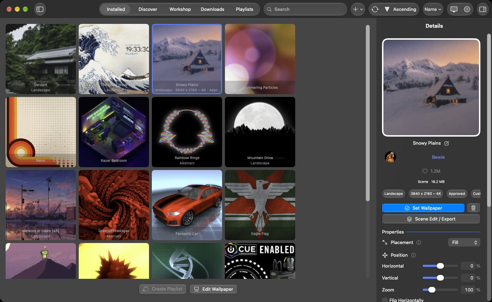
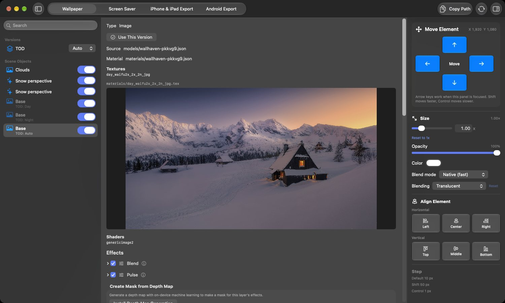
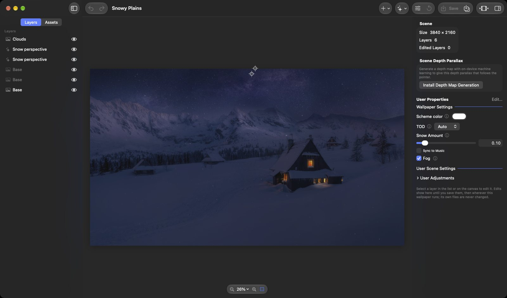

Open Wallpaper Engine
=========

[English](../../README.md) | [Deutsch](README.de.md) | [Français](README.fr.md) | [Español](README.es.md) | [Português (Brasil)](README.pt-BR.md) | [Italiano](README.it.md) | **日本語** | [한국어](README.ko.md) | [简体中文](README.zh-Hans.md) | [繁體中文](README.zh-Hant.md) | [Русский](README.ru.md) | [Polski](README.pl.md) | [Türkçe](README.tr.md) | [Українська](README.uk.md) | [العربية](README.ar.md) | [हिन्दी](README.hi.md)

Open Wallpaper Engine は、Wallpaper Engine の壁紙（シーン・動画・Web）を再生できる、無料でオープンソースの macOS 向けプレーヤーです。ネイティブの Metal レンダラーを搭載し、エフェクト、パーティクル、3D モデル、ライティング、SceneScript、オーディオ連動ビジュアル、Steam ワークショップに対応しています。Haren Chen 氏と MrWindDog 氏の [Open Wallpaper Engine](https://github.com/MrWindDog/wallpaper-engine-mac) のフォークとして始まり、現在ではその大部分が書き直されています。

> **注意：** 本プロジェクトは Steam の商用版 Wallpaper Engine とは一切関係ありません。Wallpaper Engine の Steam ワークショップにある壁紙アセットを表示できる、オープンソースの macOS アプリです。 → [ATTRIBUTION.txt](../../ATTRIBUTION.txt)

**Web サイト：** [openwallpaperengine.app](https://openwallpaperengine.app/) · **Wiki：** [ガイドとトラブルシューティング](https://github.com/deepratna-awale/open-wallpaper-engine-mac/wiki)

## 主な機能

- **シーン・動画・Web 壁紙** — シーンは各壁紙が持つ Wallpaper Engine 独自のシェーダーを Metal に変換して描画し、エフェクト、パーティクル、3D モデル、ライト、タイムライン、SceneScript、オーディオ連動ビジュアルに対応します。Web 壁紙は WebKit またはオプションの Chromium エンジンで動作します。
- **Steam ワークショップ** — アプリ内でワークショップを閲覧・絞り込み・ダウンロードできるほか、壁紙のフォルダや zip を読み込むこともできます。
- **シーン編集/書き出し** — 再生中の壁紙のレイヤーやエフェクトをデスクトップ上でリアルタイムに変更したり、その壁紙をスクリーンセーバーにしたり、（シーンと動画を）iPhone・iPad 用の Live Photo ロック画面や、Wallpaper Engine の Android アプリ用パッケージとして書き出したりできます。

  

- **壁紙エディタ** — Wallpaper Engine のエディタにならったエディタです。レイヤー、プレビュー付きのエフェクト、タイムライン、SceneScript、ユーザープロパティ、パーティクル、Puppet Warp、深度マップから作るマスクを扱えます。編集はドラフトに対して行い、**保存** で壁紙に反映し、**新規壁紙として保存** でライブラリにコピーを追加します。壁紙自体のファイルが変更されることはありません。

  

- **ディスプレイ** — Wallpaper Engine と同じく、ディスプレイごとの壁紙、複数ディスプレイへの引き伸ばしや複製、グループ、分割、プロファイルに対応します。

  

- **プレイリスト** — タイマー、ログイン時、時間帯、曜日に応じて壁紙を切り替えます。Wallpaper Engine のトランジションも使えます。

  

- **書き出し** — iPhone・iPad 用の Live Photo ロック画面と Wallpaper Engine の Android パッケージを作成し、QR コードを使って Wi-Fi 経由でスマートフォンに送信できます。

  

- **テーマ設定** — メニューバー、アクセントカラー、アイコンとフォルダの色合いが壁紙の色に合わせて変わります。Open Wallpaper Engine 自身のウインドウでは、壁紙の色そのものを使うこともできます。

  

- **MCP サーバプラグイン** — MCP クライアントから壁紙、プレイリスト、設定を変更したり、シーンを編集したりできます。接続はローカルのみで、あなたのアカウントからしか開けません。

  

そのほかの機能の分野別一覧：[docs/features.md](../../docs/features.md)

## インストール

1. [openwallpaperengine.app](https://openwallpaperengine.app/) または [GitHub Releases](https://github.com/deepratna-awale/open-wallpaper-engine-mac/releases) から最新版をダウンロードします。署名と公証済みで、自動的にアップデートされます。
2. DMG を開き、**Open Wallpaper Engine** を「アプリケーション」フォルダにドラッグします。

**macOS 14.0（Sonoma）以降**が必要です。一部の機能には、より新しい macOS、アクセス許可、またはプラグインが必要です。詳しくは[はじめに](../../docs/getting-started.md#requirements)を参照してください。

## クイックスタート

1. アプリを開きます。セットアップアシスタントで、言語、SteamCMD、Steam へのログイン、Wallpaper Engine のアセットを設定し、Wallpaper Engine のお気に入りを読み込むこともできます。どの手順もスキップできます。
2. シーン壁紙を使う場合は、Wallpaper Engine のアセットをインストールします（*設定 › アセット*）。アセットはお持ちの Steam 版 Wallpaper Engine から取得します。動画壁紙と Web 壁紙はアセットなしで動作します。
3. **発見**タブと**ワークショップ**タブで壁紙を探すか、壁紙のフォルダや zip を読み込みます（*ファイル › フォルダから壁紙を読み込む…*、⌘I）。
4. ライブラリで壁紙をクリックし、詳細の **壁紙を設定** をクリックします（または壁紙を右クリックして **壁紙に設定** を選びます）。その下に壁紙のプロパティが表示されます。

詳しくは[はじめに](../../docs/getting-started.md)と [Wiki](https://github.com/deepratna-awale/open-wallpaper-engine-mac/wiki) をご覧ください。

## プライバシー

アプリが保存するものはすべてお使いの Mac に残り、データや分析情報は一切収集しません。通信先は Steam（ワークショップとアセット用）、openwallpaperengine.app（アップデートの確認用）、GitHub（アップデートのダウンロード用）で、プラグインはインストールしたときにだけダウンロードされます。詳細：[アプリの通信先](../../docs/getting-started.md#what-the-app-connects-to)と[プライバシーポリシー](../../docs/legal/privacy-policy.md)

## ドキュメント

- [はじめに](../../docs/getting-started.md) — 必要条件、アセット、ワークショップ、読み込み
- [機能](../../docs/features.md) — アプリが対応しているすべての機能と使い方
- ガイド：[ディスプレイレイアウト](../../docs/display-layouts.md) · [プレイリスト](../../docs/playlists.md) · [スクリーンセーバー](../../docs/screen-saver.md) · [iPhone・iPad への書き出し](../../docs/iphone-ipad-export.md) · [Android への書き出し](../../docs/android-export.md) · [深度マップ](../../docs/depth-maps.md) · [テーマ](../../docs/theming.md) · [MCP サーバー](../../docs/mcp.md) · [Chromium Web エンジン](../../docs/chromium-engine.md)
- [開発](../../docs/development.md) — ソースからのビルドとプロジェクトの構成。[CONTRIBUTING.md](../../CONTRIBUTING.md) と[アーキテクチャ](../../docs/architecture.md)も参照
- [Wiki](https://github.com/deepratna-awale/open-wallpaper-engine-mac/wiki) — ガイド、設定リファレンス、トラブルシューティング

## 関連プロジェクト

- **[Open Wallpaper Engine for Linux](https://github.com/Unayung/simple-linux-wallpaperengine-gui)** — [linux-wallpaperengine](https://github.com/Almamu/linux-wallpaperengine) 向けの PyQt6 GUI です。Steam ワークショップとの連携と UI デザインは、この macOS 版から移植されています。

## クレジット

本プロジェクトは、以下の方々の成果の上に構築されています：

- **[MrWindDog](https://github.com/MrWindDog)** — 上流の [wallpaper-engine-mac](https://github.com/MrWindDog/wallpaper-engine-mac) フォークのメンテナー。新機能と UI の改良を追加
- **[Haren Chen](https://github.com/haren724)** — [open-wallpaper-engine-mac](https://github.com/haren724/open-wallpaper-engine-mac) のオリジナル作者。アプリのコアアーキテクチャ（SwiftUI、ビデオ壁紙の再生、読み込みシステム、プレイリスト UI）を構築
- **1ris_W** — 中国語 i18n 翻訳
- **[Klaus Zhu](https://github.com/klauszhu1105)** — オリジナルのロゴデザイン
- **[Chen Chia Yang](https://github.com/Unayung)** — シーン壁紙のレンダリング、Web 壁紙の修正、Steam ワークショップとの連携、マルチディスプレイ対応、zip の読み込み
- **[Deepratna Awale](https://github.com/deepratna-awale)** — Metal シーンレンダラーとエフェクトパイプライン、GLSL→MSL シェーダー変換とキャッシュ、SceneScript ランタイム、オーディオレスポンスのレンダリング、ワークショップ／ダウンロードの全面改良、配置とパフォーマンスの設定、ロゴのリデザイン

オリジナルのプロジェクトと同じく、[GPL-3.0](../../LICENSE) のもとでライセンスされています。

## 法的事項

[利用規約](../../docs/legal/terms-of-use.md) · [プライバシーポリシー](../../docs/legal/privacy-policy.md) · [セキュリティポリシー](../../SECURITY.md)

- **English:** Please read the Terms of Use and the Privacy Policy.
- **Deutsch:** Bitte lesen Sie die Nutzungsbedingungen und die Datenschutzrichtlinie.
- **Français :** Veuillez lire les conditions d’utilisation et la politique de confidentialité.
- **Español:** Lee las condiciones de uso y la política de privacidad.
- **Português (Brasil):** Leia os Termos de Uso e a Política de Privacidade.
- **Italiano:** Leggi le condizioni d’uso e l’informativa sulla privacy.
- **日本語：** 利用規約とプライバシーポリシーをお読みください。
- **한국어:** 이용 약관과 개인정보 처리방침을 읽어 주십시오.
- **简体中文：** 请阅读使用条款和隐私政策。
- **繁體中文：** 請閱讀使用條款和隱私權政策。
- **Русский:** Прочитайте условия использования и политику конфиденциальности.
- **Polski:** Przeczytaj warunki korzystania i politykę prywatności.
- **Türkçe:** Lütfen Kullanım Koşulları’nı ve Gizlilik Politikası’nı okuyun.
- **Українська:** Прочитайте умови використання та політику приватності.
- **العربية:** يُرجى قراءة شروط الاستخدام وسياسة الخصوصية.
- **हिन्दी:** कृपया उपयोग की शर्तें और गोपनीयता नीति पढ़ें।
